* АиСД-2, 2023, Задание 5
* Бирюлин Никита Андреевич, БПИ213
* VS Code, сборка через CMake, визуализация через Python/Matplotlib/Pandas

Что получилось:
* Все сортировки анализируются на количество операций и время выполнения в нс., данные по времени усредняются
* Код для сортировок собирался в дефолтной конфигурации Release Cmake'а
* Все анализы выполнены с двумя категорями размеров массивов, с четырьмя типами массивов, как в задании
* После каждого прогона (вне замера времени) проверяется корректность сортировки
* Исходные данные сохранены в ./data
* Аггрегированные данные сохранены в aggregate_data.csv
* Графики по данным строятся скриптом graphs.py
* Графики доступны в ./graphs
* Благодаря магии RAII память не течет
* Используется std::function, минимальное дублирование кода
* Генератор случайных чисел корректно инициализируется

Что интересного можно увидеть на графиках:
* Квиксорт может быть очень медленным на маленьких массивах
* Квиксорт (И, неожиданно, пузырек с вторым условием) может сильно скакать по производительности
* Сортировка, совершающая в n раз меньше операций, может быть быстрее больше чем в n раз (вероятно, из-за более оптимального использования кешей)
* У сортировок есть небольшой скачок в времени выполнения при сортировке полностью обратно отсортированных массивов примерно на границе в 1100 элементов. Скорее всего, тоже дела с кешированием.
* На достаточно больших чисел и количество операций, и скорость ведет себя ожидаемо асимптотике
* Ожидаемо, во всех случаях быстрее всего сортируются "почти отсортированные", медленнее всего - обратно отсортированные.

Сами графики:

```
Для того, чтобы все поместилось на графики, использую некоторые сокращения:
* smallSize - массивы 50-300 с шагом 50
* bigSize - массивы 100-4100 с шагом 100
* almost0-4000 - "почти отсортированный массив", с числами от 0 до 4000
* random0-4000 - случайный массив, с числами от 0 до 4000
* random0-5 - аналогично
* reverse4100-1 - обратно отсортированный массив с числами от 4100 до 1
```


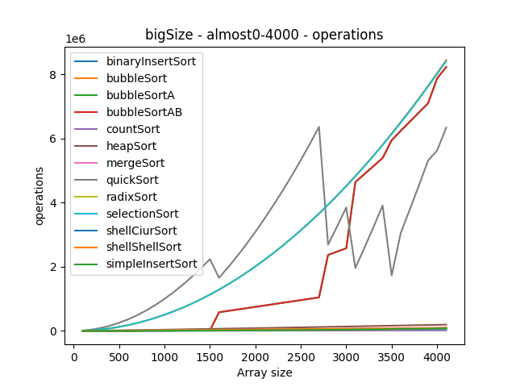

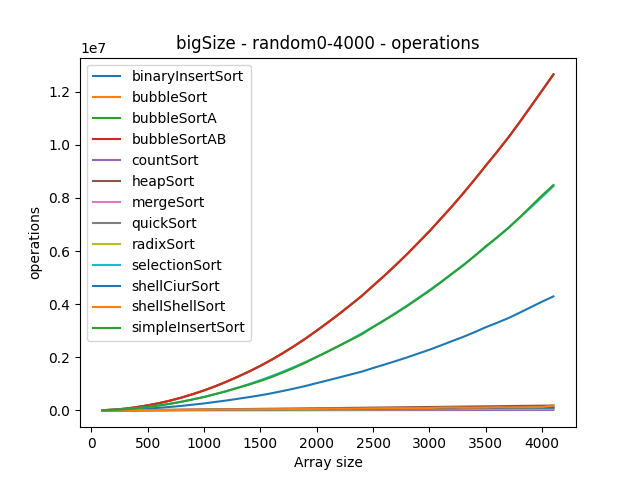

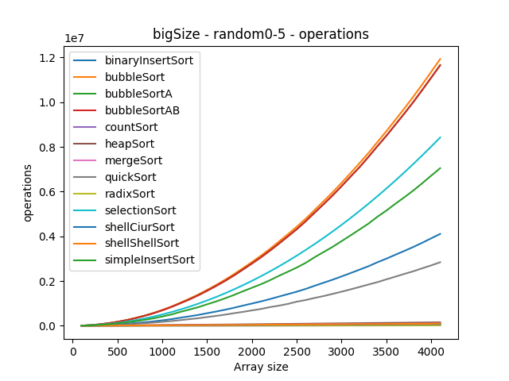


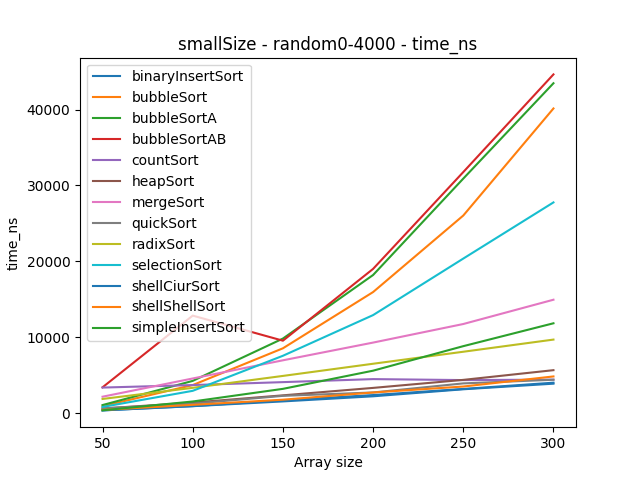


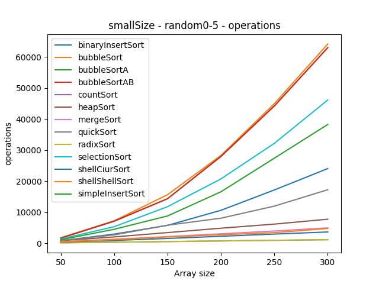
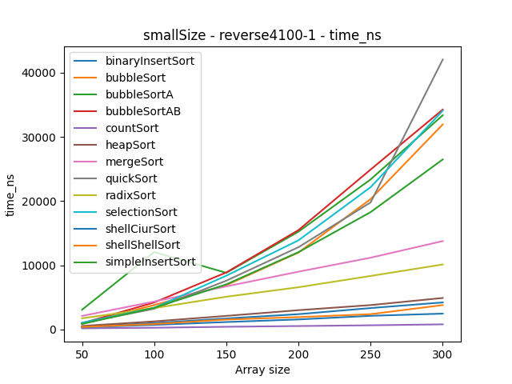

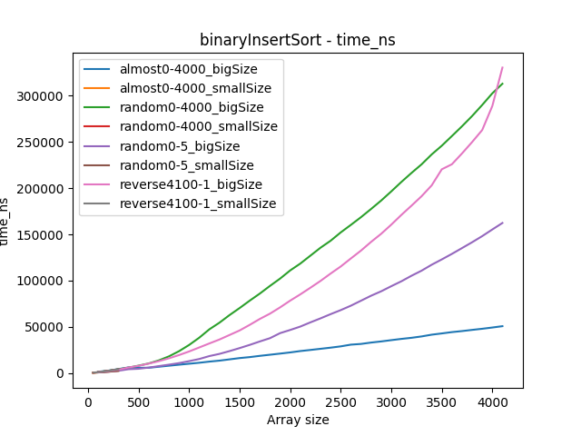
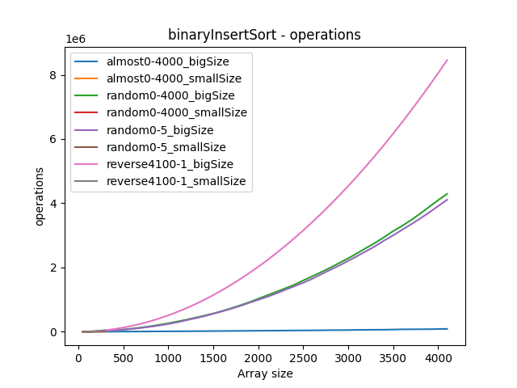


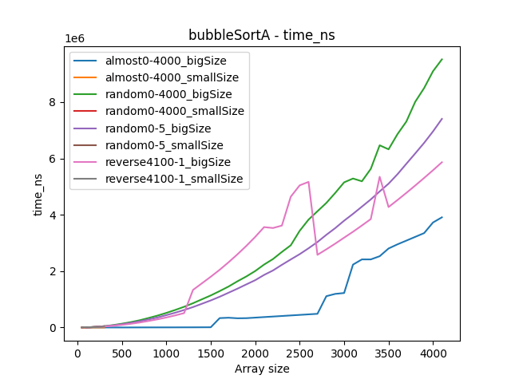


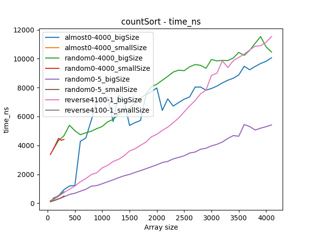


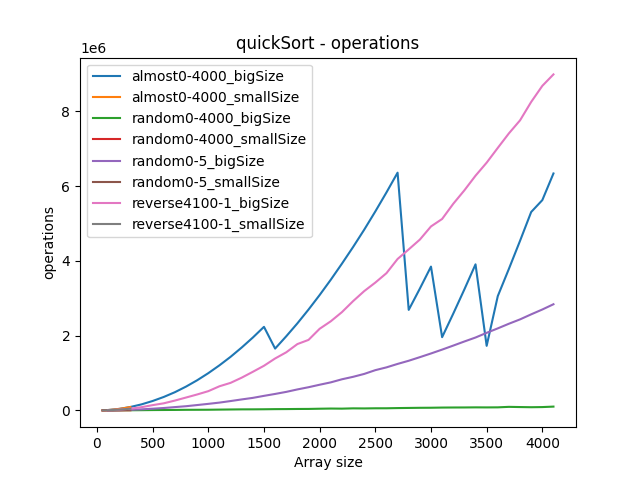


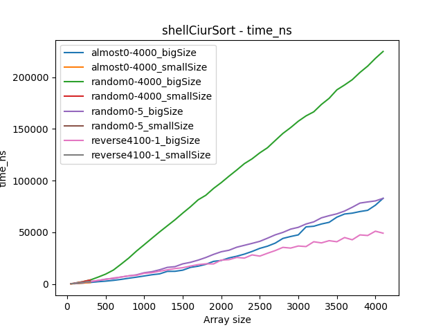

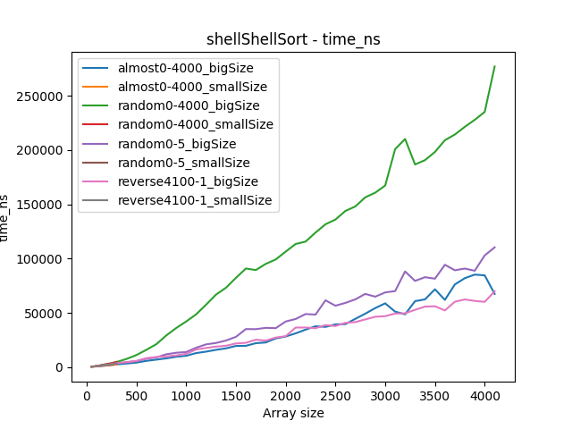


