# КДЗ2

Бирюлин Никита Андреевич, БПИ213

С помощью C++/Python проанализировал наивный и два варианта алгоритма КМП по времени и количеству операций в соответствии с требованиями.
Из особенностей:
* Все тесты прогонялись на большом (но одинаковом) наборе случайных текстов. Таким образом с одной стороны у нас достаточно большой набор текстов, чтобы какие-то отдельные удачные для конкретного алгоритма не ломали всю оценку, но с другой стороны, все алгоритмы в конечном счете анализируются на одинаковых входных данных. Это исправляет аналогичную ошибку из прошлого КДЗ.
* Насколько я понимаю, КМП с утонченными гранями нельзя заставить нормально работать с символами подстановки. Мое решение - нагенерировать все возможные варианты строк (заменяя каждую подстановку на каждый возможный символ из алфавита), и проверять каждый. Таким образом при анализе подстановок этот алгоритм становится медленным непропорционально количеству операций сравнения.
* cooler_kmp - КМП с утонченными гранями. Остальное кажется понятное.

Что можно увидеть из графиков:
* КМП с утонченными гранями - медленный. Он может выигрывать по количеству операций, но это скорее особенность подсчета (подсчитывать только сравнения). Если нет подстановок, он работает аналогично или медленнее обычного КМП. Если они есть, он становится абсолютно бесолезным.
* Подстановки убивают КМП с утонченными гранями по причинам, описанным выше. При этом в остальных алгоритмах, где их подстановка "нативная" (выражается в паре дополнительных условий) такой цены по времени нет.
* Сравнение в лоб - быстрое! Быстрее всего остального, даже в случаях, когда проигрывает по количеству операций. Это ожидаемо: вместо сложного алгоритма мы просто в лоб проходим по массиву. Кеши используются идеально, нет такого количества условных переходов. Возможно, КМП может его обойти на массивах на несколько порядков больше, когда они в любом случае перестанут влезать в кеши.

Формат нейминга графиков: {алфавит} - {размер текста} - {количество символов подстановки} - {тип метрики}

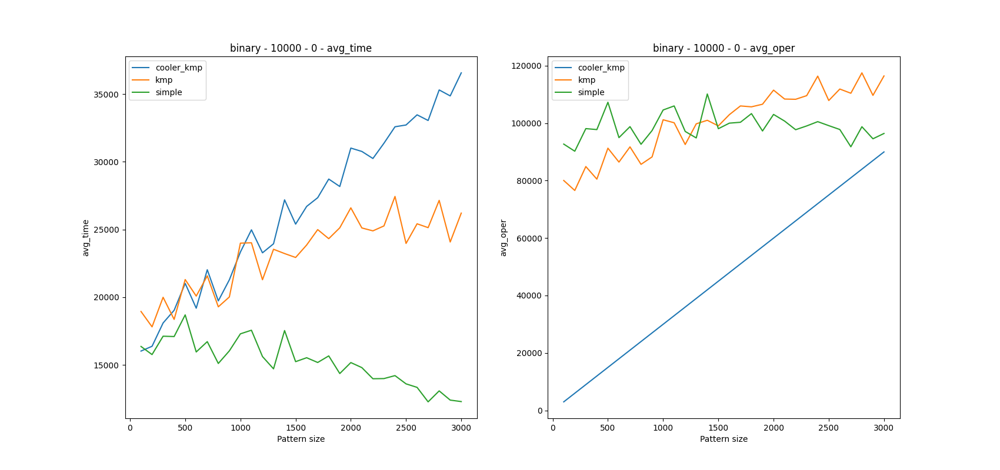
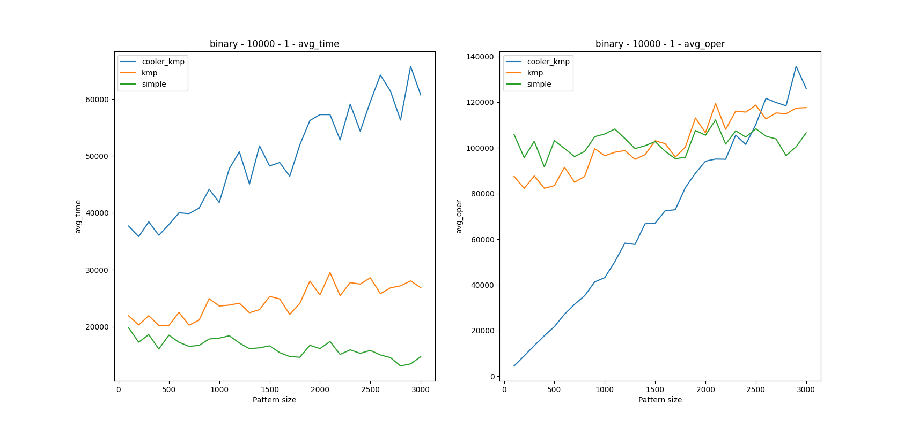
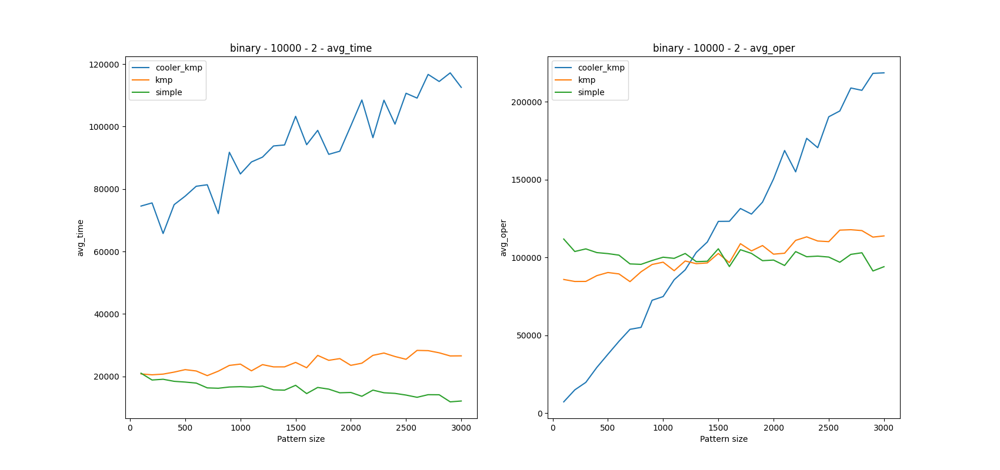
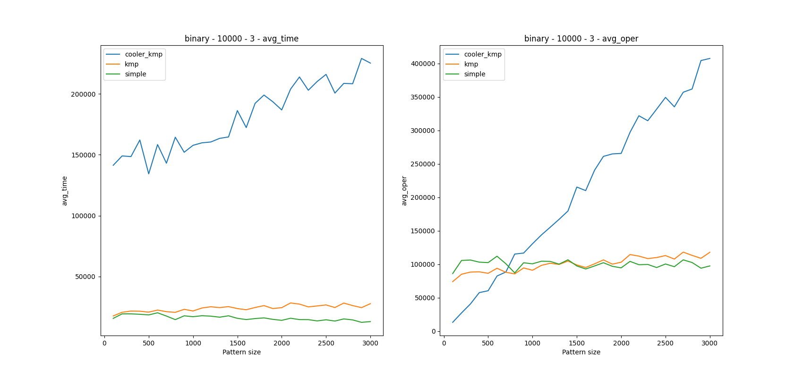
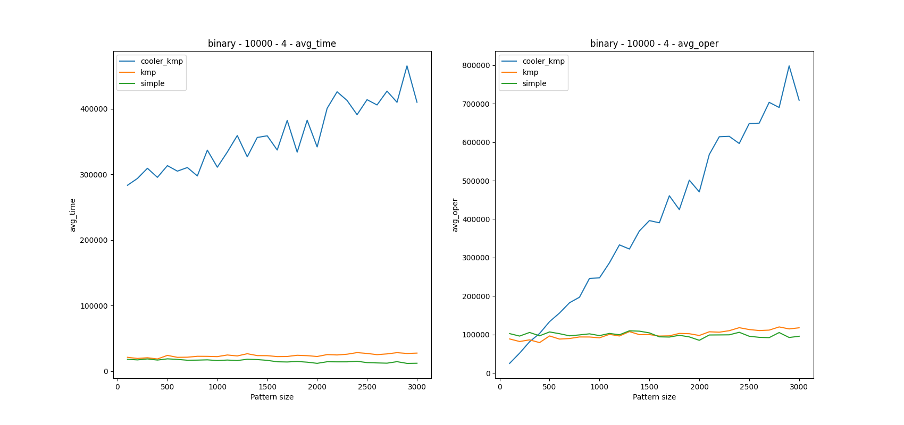
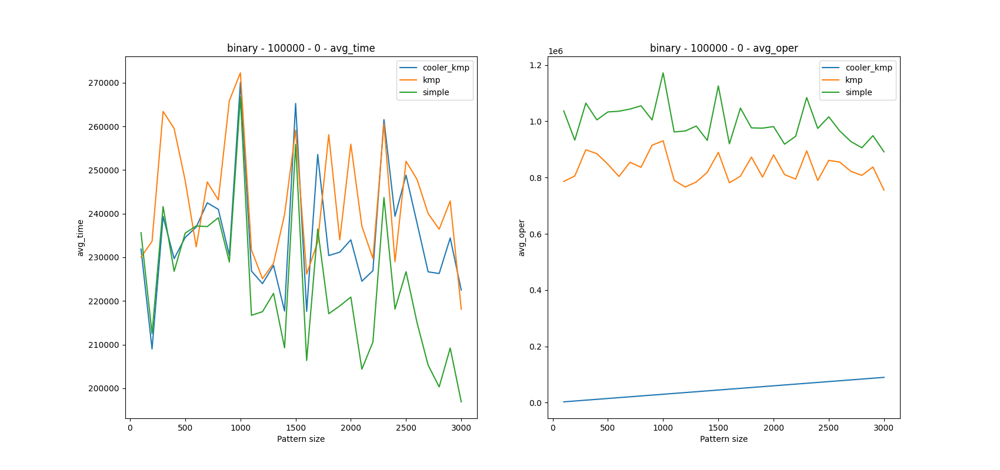
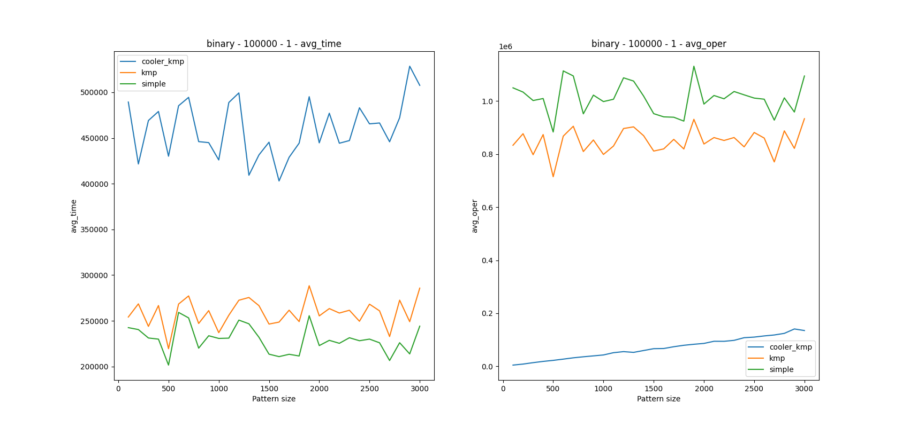
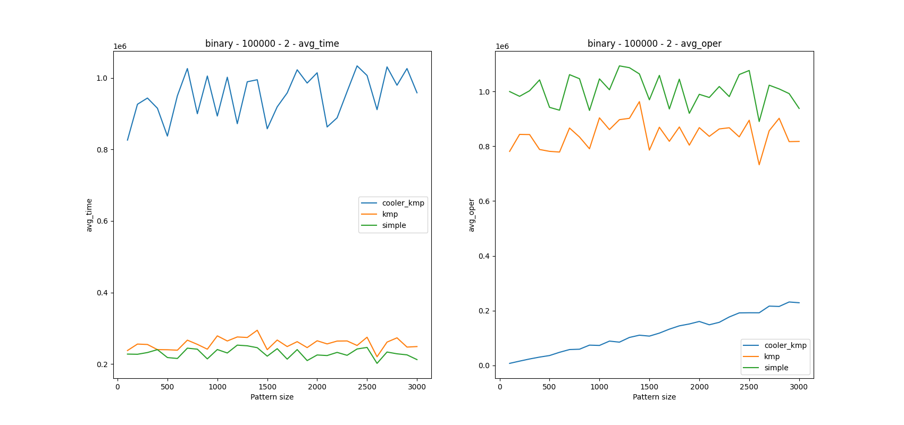
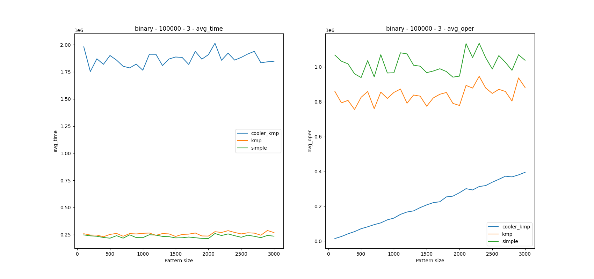
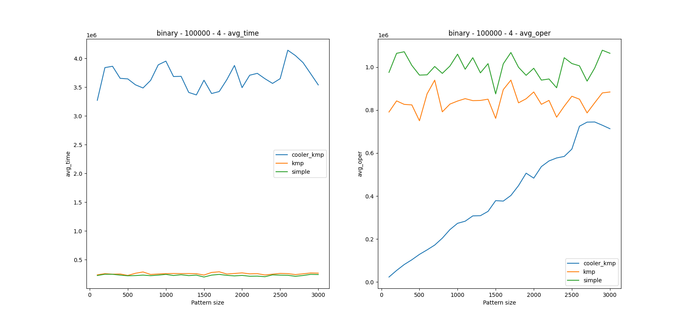
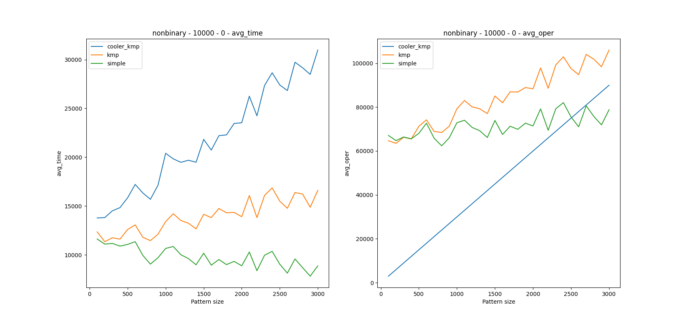
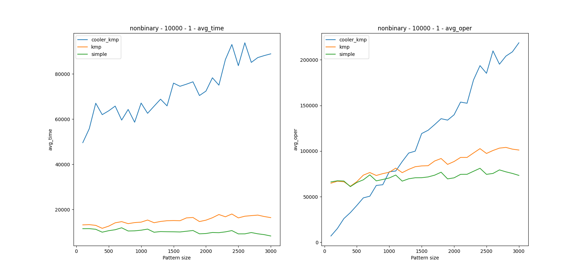
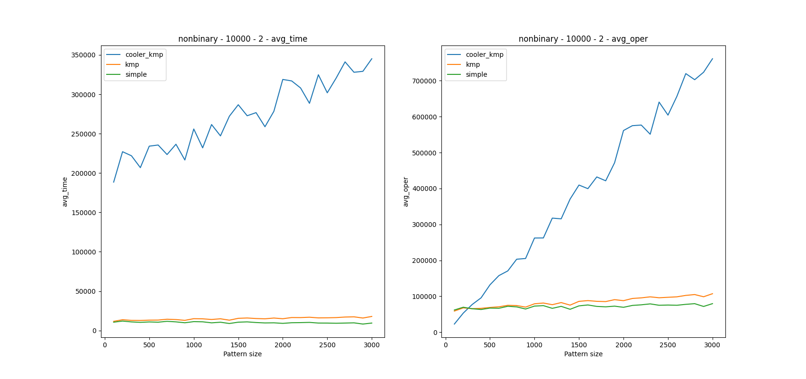
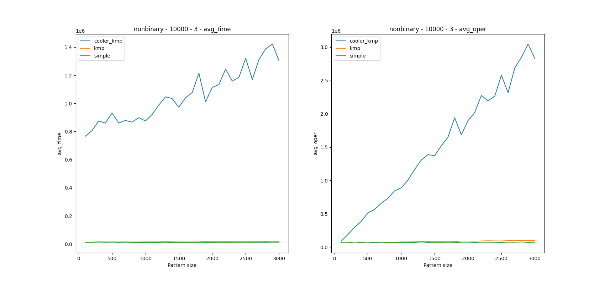
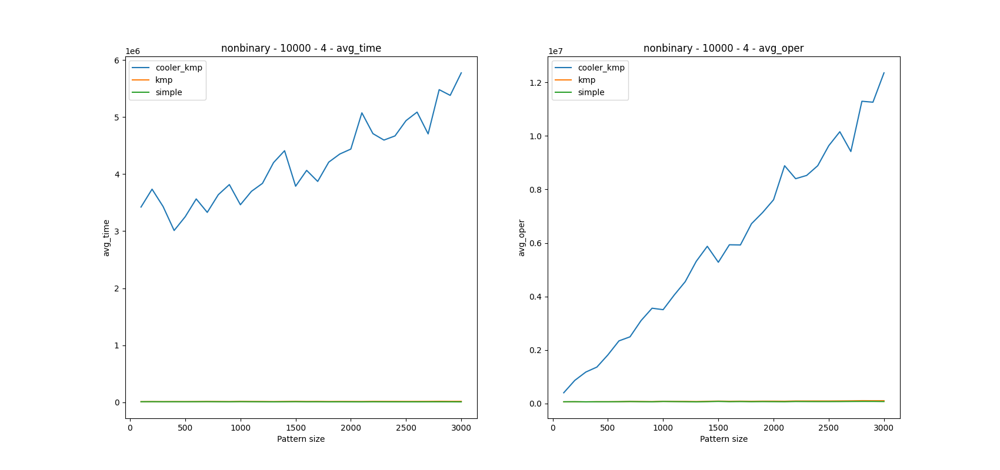
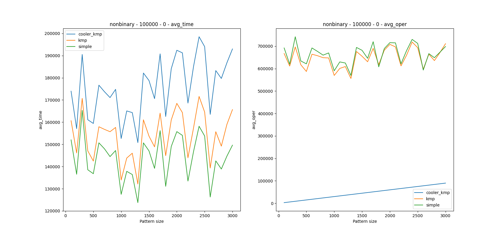
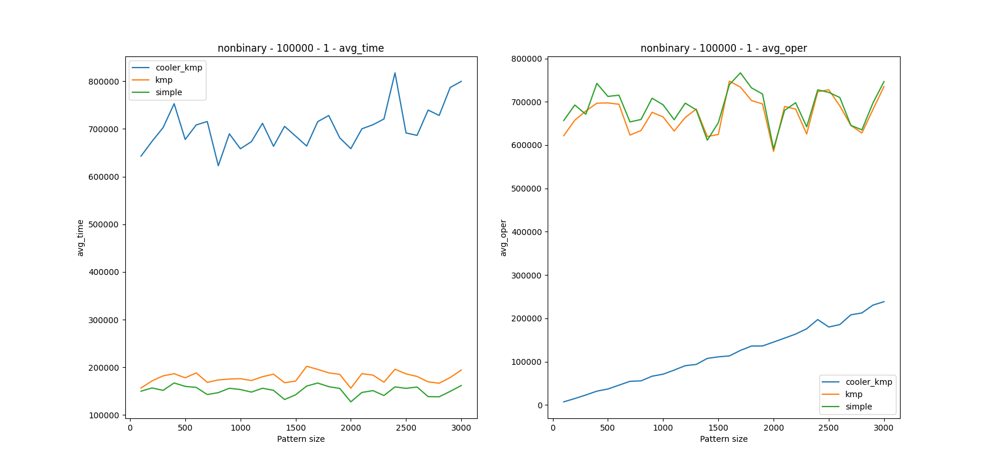
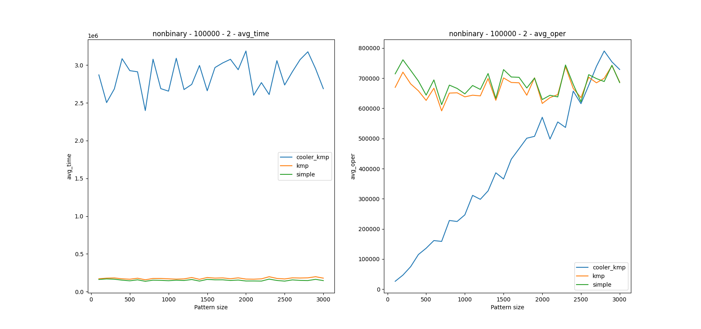
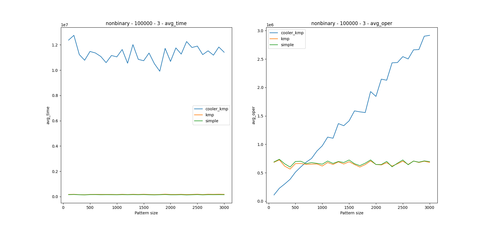
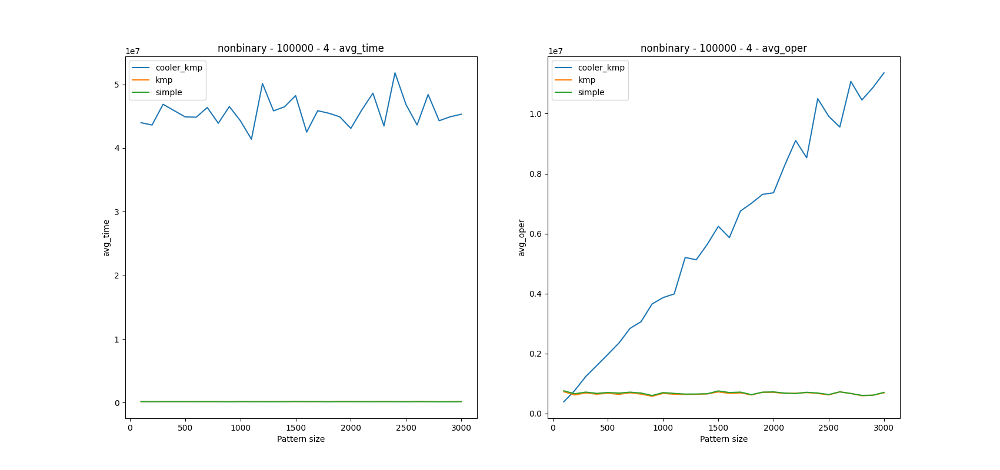